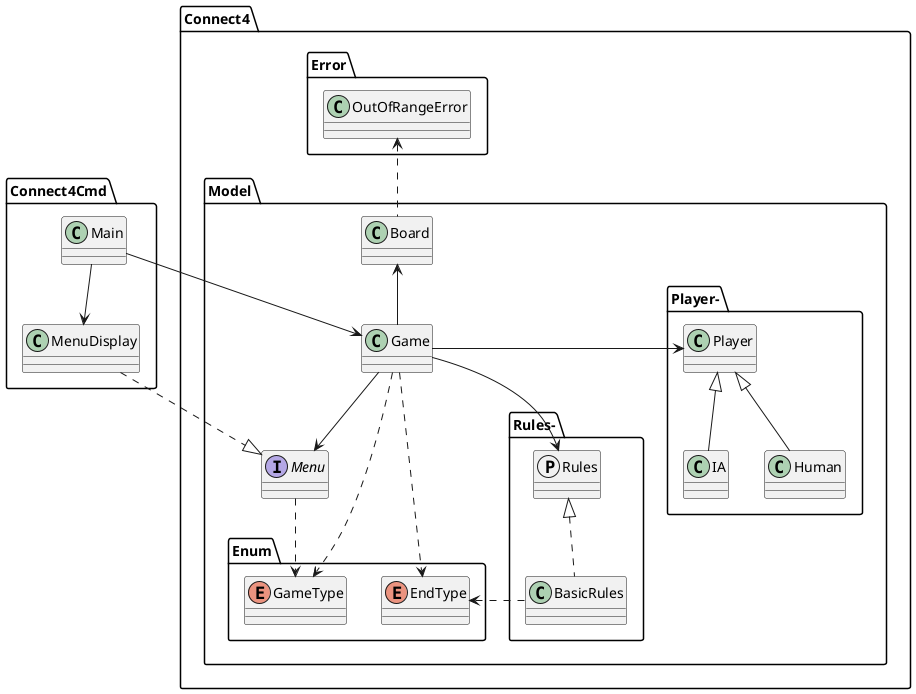

# Connect4 

[](https://codefirst.iut.uca.fr/julien.theme/SWIFT-Connect4)

# Description

This project is a Connect4 game. It is a school project for the professional degree in mobile application, at the University of Clermont Auvergne.

>University : Université Clermont-Auvergne, Aubière, France.  
>District : IUT Informatique.

# Class Diagram


# Languages and Tools:
- Swift 5.7.1
- Xcode 14.1

# Installation
1. Clone the repository to your local machine :  
    ```
    git clone https://codefirst.iut.uca.fr/julien.theme/SWIFT-Connect4.git
    ```
2. Open the project in Xcode    
3. Build and run the project   
4. Follow the prompts in the command line to play the game 

# Tests
For testing the project, verify that the scheme is set to "Connect4Tests" and just click on the play button in Xcode. 
The tests will be executed.

# Roadmap
[x] Play with a friend  
[x] Play with an IA  
[ ] Choose the rules of the game   
    -> [x] Basic rules  
    -> [ ] Custom rules (the structure is ready for that, just have to implement it)

# Authors
<a href='https://github.com/ZIRTR0X'>Julien THÊME</a>

# License
This project is licensed under the MIT License.

